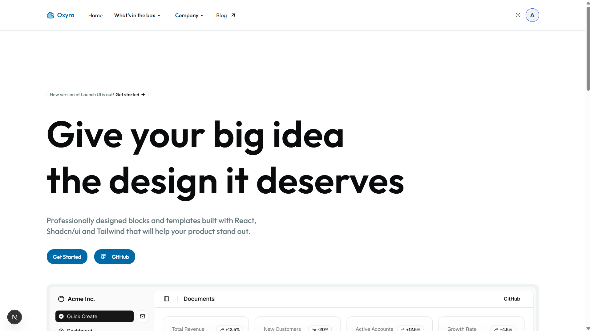
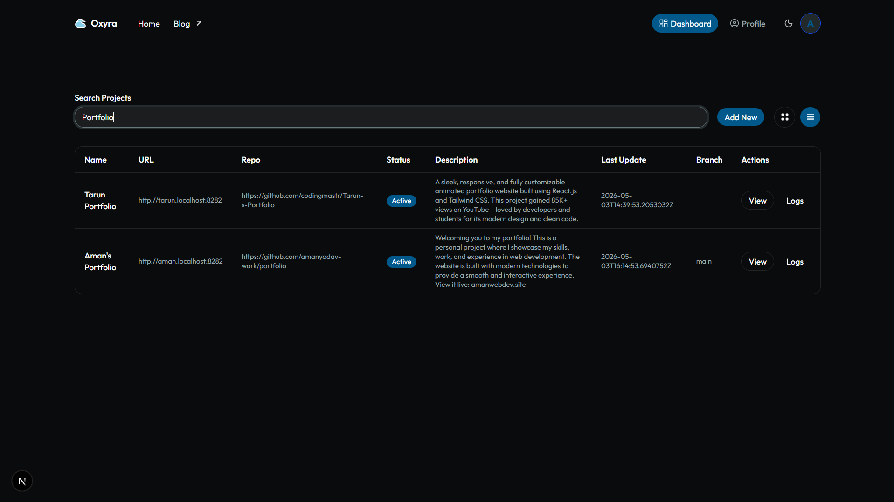
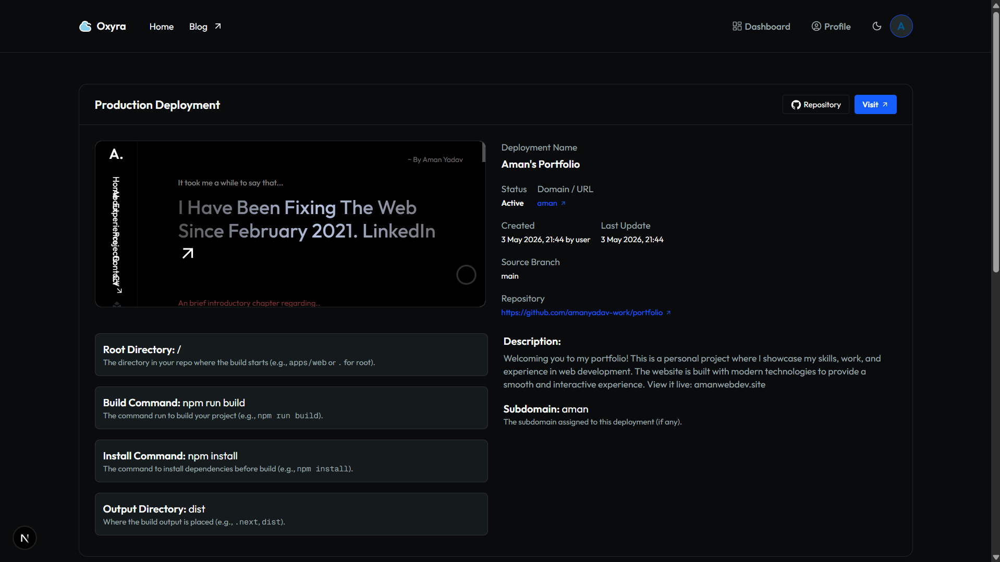

# Oxyra (Cloud Pipeline)

**Oxyra** is a backend-heavy, modular cloud deployment platform focused on scalable, observable, and automated build/deploy pipelines. It is designed for developers who want full control over their deployment infrastructure, with a strong emphasis on Go-based backend microservices, event-driven architecture, and cloud-native patterns.

<p align="center">
  
  <br/>
  
  
</p>

---

## Monorepo Structure

```
Oxyra/
├── api-server/         # Go REST API, WebSocket, Kafka, DB, Auth
├── build-server/       # Go build/CI server, Git, S3/B2, Kafka
├── proxy-server/       # Go asset proxy, S3/B2, subdomain routing
└── oxyra-cloud-client/ # Next.js dashboard (React, Tailwind)
```

---

## System Overview
Oxyra is a distributed system with clear separation of concerns:
- **api-server:** Central API, orchestrates users, projects, deployments, and real-time logs.
- **build-server:** Stateless CI/CD worker, executes builds, streams logs, uploads artifacts.
- **proxy-server:** Secure static asset proxy, handles custom domains, fetches from S3/B2.
- **oxyra-cloud-client:** Modern dashboard for managing projects, deployments, and logs.

---

## 1. api-server (Go)
**Role:** Core orchestrator and API gateway for the platform.

### Key Responsibilities
- **REST API:** CRUD for users, projects, deployments, authentication (JWT), and project metadata.
- **WebSocket:** Real-time log streaming to dashboard clients. Each project can subscribe to its own log channel.
- **Kafka Consumer:** Listens to build-server log events, persists logs to DB, pushes to WebSocket clients.
- **Database:** Uses GORM (ORM) with SQLite (default) for users, projects, logs. Handles migrations and relations.
- **S3/B2 Integration:** Stores and retrieves build artifacts and static assets.
- **Auth:** Handles registration, login, JWT issuance, and user context for all API calls.
- **Environment:** Loads secrets and config from `.env` (DB, S3, Kafka, etc).

### Internal Flow
1. **User creates project** → API stores metadata, generates subdomain, sets up DB records.
2. **User triggers deployment** → API creates deployment record, sends job to build-server (via Kafka or REST).
3. **Build logs** → Consumed from Kafka, stored in DB, pushed to WebSocket clients in real time.
4. **Asset requests** → API provides signed URLs or proxies via proxy-server.

---

## 2. build-server (Go)
**Role:** Stateless CI/CD worker, responsible for building, packaging, and uploading user projects.

### Key Responsibilities
- **Job Intake:** Receives build jobs (via Kafka or REST), each with repo URL, branch, build/install/output commands, and project metadata.
- **Git Operations:** Clones the specified repo/branch into a sandboxed directory.
- **Build Pipeline:**
  - Runs install command (e.g., `npm install`, `go mod tidy`).
  - Runs build command (e.g., `npm run build`, `go build`).
  - Collects output from specified directory (e.g., `.next`, `dist`).
- **Artifact Upload:** Uses AWS S3 or Backblaze B2 SDK to upload build output to a bucket, under a project-specific path.
- **Log Streaming:** Streams stdout/stderr and custom log events to Kafka (topic: `logs`), keyed by project/deployment ID.
- **Environment:** All config (S3, Kafka, repo, etc) is injected via environment variables or Docker secrets.

### Internal Flow
1. **Receives job** → Clones repo, checks out branch.
2. **Executes pipeline** → Runs install/build/output commands, captures logs.
3. **Uploads output** → Pushes to S3/B2, emits log events to Kafka.
4. **Signals completion** → Final log event, notifies API server (optional webhook).

---

## 3. proxy-server (Go)
**Role:** Secure, performant proxy for static assets and custom domains.

### Key Responsibilities
- **Subdomain Routing:** Parses incoming requests, maps subdomains to projects using DB lookup.
- **S3/B2 Fetch:** Fetches static assets from S3/B2 using project/bucket mapping.
- **CORS & Security:** Handles CORS, sets appropriate headers, prevents path traversal.
- **Custom Domains:** Can be extended to support custom domain mapping (CNAME, etc).
- **DB:** Uses GORM/SQLite for project/domain mapping.
- **Performance:** Designed for high concurrency, minimal latency, and secure asset delivery.

### Internal Flow
1. **Receives HTTP request** → Parses host/subdomain, looks up project.
2. **Fetches asset** → Retrieves from S3/B2, streams to client.
3. **Handles errors** → Returns 404/403 as appropriate, logs access.

---

## 4. oxyra-cloud-client (Next.js)
**Role:** Modern dashboard for developers to manage projects, deployments, and view logs.

### Key Responsibilities
- **Authentication:** Login/signup, JWT storage, user context.
- **Project Management:** Create, view, delete projects; connect GitHub repo; configure build settings.
- **Deployment UI:** Trigger deployments, view status, see live logs (WebSocket), preview output (iframe).
- **Logs:** Real-time log streaming per project, historical log access.
- **API Proxy:** All `/api/*` routes are proxied to Go API server (see `next.config.ts`).
- **UI/UX:** Built with shadcn/ui, Tailwind, MUI, Sonner, Lucide, Radix, etc.

---

## Technical Highlights
- **Event-Driven:** Kafka is used for log/event streaming between build-server and api-server.
- **Cloud-Native:** All services are stateless, can be containerized and scaled independently.
- **Observability:** Logs are persisted, streamed, and queryable per project/deployment.
- **Security:** JWT auth, CORS, secure asset proxying, environment isolation.
- **Extensibility:** Add more build-server workers, support more SCMs, extend proxy for custom domains.

---

## Development & Deployment

### Prerequisites
- Go 1.21+
- Node.js 18+/19+
- Docker (for build-server)
- SQLite (default), or configure for Postgres/MySQL
- AWS S3 or Backblaze B2 credentials
- Kafka broker (local or cloud)

### Environment Variables
- Each service uses its own `.env` file (see `.env.sample` in each folder)
- Key variables: DB connection, S3/B2 keys, Kafka brokers, API URLs, etc.

### Running Locally
1. **API Server:**
  ```bash
  cd api-server
  go run .
  OR 
  air
  ```
2. **Build Server:**
  ```bash
  cd build-server
  docker build -t build-server .
  docker run --env-file .env build-server
  ```
3. **Proxy Server:**
  ```bash
  cd proxy-server
  go run .
  OR 
  air
  ```
4. **Client (Dashboard):**
  ```bash
  cd oxyra-cloud-client
  npm install
  npm run dev
  ```

---

## Example Build Flow
1. User triggers deployment from dashboard.
2. API server creates deployment record, sends job to build-server.
3. Build-server clones repo, runs pipeline, streams logs to Kafka.
4. API server consumes logs, stores in DB, pushes to dashboard via WebSocket.
5. Build-server uploads output to S3/B2.
6. Proxy-server serves assets on subdomain.

---

## Credits
- Inspired by Vercel, Netlify, Render, Railway
- Built with Golang, Gin, GORM, Kafka, S3/B2, Docker, SQLite, ShadCN Ui, Next.js, Tailwind,
